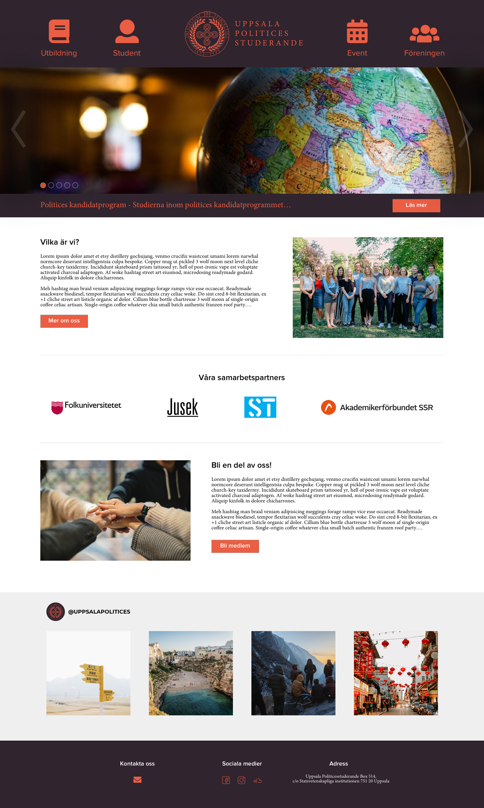
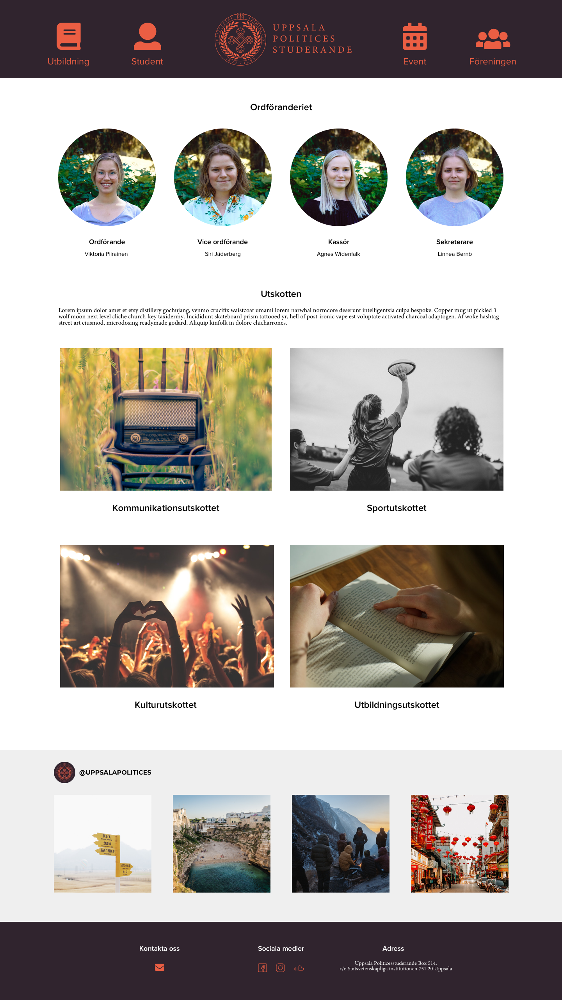

# Uppsala Politices - ny hemsida
Uppsala Politices studerandes programförening ville ha en ny, mer användarvänlig hemsida, som skulle vara lättare att administrera.

# Varför tog vi oss an projektet?
Vi var några stycken som ville ha ett skarpt projekt för att lära oss om hur man kan bygga en hemsida med ett av de populära javascriptramverken, kombinerat med ett CMS. 

# Screenshots - design
Nedan visas några screenshots på hemsidans design, som gjordes i Sketch.

## Startsida

## Föreningssida

## Mobil - startsida

# Tech & Ramverk
I detta projekt så användes följande:
- [HTML5](https://www.w3schools.com/html/html5_intro.asp)
- [PostCSS](https://postcss.org/)
- [JavaScript](https://developer.mozilla.org/sv-SE/docs/Web/JavaScript)
- [Vue.js](https://vuejs.org/)
- [PHP](http://www.php.net/)
- [WordPress](https://sv.wordpress.com/)
    - [Advanced Custom Fields](https://www.advancedcustomfields.com/)
- [BEM](http://getbem.com/)
- [Gulp](https://gulpjs.com/)

# Features
Inte specifierat ännu.

# Sätta upp och använda utvecklingsmiljö
För att kunna bidra till projektet så behöver du ha en korrekt uppsatt utvecklingsmiljö. Se mer i våra wiki.

# Credits
Inte specificerat ännu.